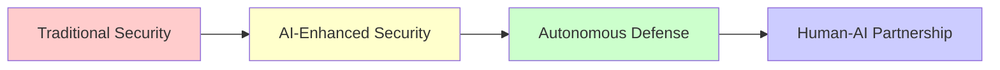
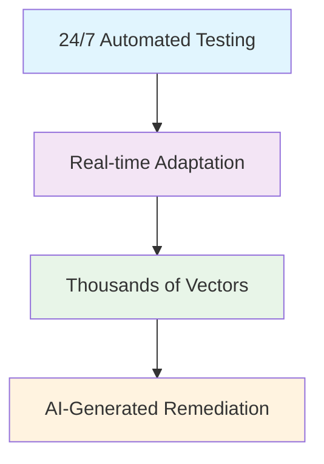
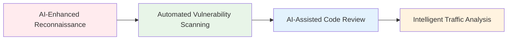

# 🤖 From Scripts to Systems: AI-Driven Cybersecurity Battlefield

<div align="center">

[](https://opensource.org/licenses/MIT)
[](https://github.com/topics/cybersecurity)
[](https://github.com/topics/artificial-intelligence)
[](#)
[](https://github.com/username/ai-cybersecurity)

**A comprehensive guide to understanding the intersection of AI and cybersecurity in 2026 and beyond**

*How artificial intelligence is fundamentally transforming digital warfare—both for defenders and attackers*

[⭐ Star this repo](https://github.com/username/ai-cybersecurity) · [🐛 Report Issue](https://github.com/username/ai-cybersecurity/issues) · [💬 Discussion](https://github.com/username/ai-cybersecurity/discussions)

</div>

---

## 📋 Quick Navigation

| 🚀 **Getting Started** | 📚 **Core Concepts** | 🛠️ **Practical Tools** | 🔮 **Future Trends** |
|------------------------|---------------------|------------------------|---------------------|
| [Beginner's Path](#-getting-started-for-beginners) | [The AI Shift](#-the-shift-from-manual-to-intelligent) | [Security Stack](#-the-new-security-stack) | [Coming Transformations](#-coming-transformations) |
| [Intermediate Path](#-for-intermediate-practitioners) | [Real Use Cases](#-real-use-cases) | [AI Tools](#-key-ai-powered-tools) | [New Elite Profile](#-the-new-elite-profile) |
| [Advanced Path](#-for-advanced-practitioners) | [Attacker's Advantage](#-the-attackers-advantage) | [Skill Formula](#-the-skill--ai-formula) | [Action Plan](#-your-action-plan) |

---

## 🎯 Key Takeaways

> **TL;DR**: AI is reshaping cybersecurity faster than ever before. The barrier to entry for sophisticated security work is dropping dramatically. Skilled professionals who combine fundamentals with AI literacy will lead the field. Adaptation is not optional—it's essential for remaining relevant.



---

## 🔄 The Shift: From Manual to Intelligent

### Then vs Now

| 🕰️ **Traditional Approach** | 🚀 **AI-Enhanced Approach** |
|----------------------------|----------------------------|
| Manual port scanning with Nmap | AI-powered reconnaissance mapping entire attack surfaces in minutes |
| Custom Python scripts for individual targets | Machine learning models predicting vulnerabilities before discovery |
| Hours analyzing log files manually | Automated pentesting that adapts in real-time |
| Signature-based detection systems | Behavioral analysis understanding intent, not just actions |

<details>
<summary>📖 Deep Dive: The Evolution Timeline</summary>

**2018-2020**: Early AI adoption in enterprise security
**2021-2023**: Democratization of AI tools for security professionals
**2024-2025**: AI becoming standard in security operations
**2026+**: Autonomous defense systems and AI-vs-AI warfare

</details>

---

## 🎯 Real Use Cases

### 🛡️ SIEM Systems on Steroids

Modern AI-enhanced SIEM systems go far beyond log aggregation:

| Capability | Benefit | Real Impact |
|-----------|---------|-------------|
| **Anomaly Detection** | Learn "normal" behavior and flag deviations | 3 hours earlier ransomware detection |
| **Predictive Analytics** | Predict attacks based on subtle patterns | 40% reduction in breach impact |
| **NLP Integration** | Automatically parse and act on threat intelligence | 10x faster threat response |

> **💡 Case Study**: Darktrace detected sophisticated ransomware 3 hours before deployment by identifying unusual lateral movement patterns that no human analyst would have caught.

### 🔍 Automated Continuous Pentesting

<div align="center">



</div>

**Leading Platforms:**
- **[Pentera](https://www.pentera.io/)** - Enterprise-grade automated security validation
- **[Cymulate](https://www.cymulate.com/)** - Continuous security testing
- **[AttackIQ](https://www.attackiq.com/)** - Adversary emulation and testing

### 🧠 AI-Powered Threat Intelligence

Platforms like **ThreatQuotient** and **Recorded Future** are revolutionizing how we understand threats:

- 🌐 Analyze millions of data points from dark web, social media, technical blogs
- ⚡ Identify emerging threats before widespread exploitation
- 🎯 Generate industry-specific actionable intelligence
- 🔮 Predict attacker targeting patterns with 85% accuracy

---

## 🌑 The Attacker's Advantage

### 🎣 AI-Generated Phishing

<details>
<summary>📊 Statistics: The Phishing Evolution</summary>

- **Traditional phishing**: 5-10% click-through rate
- **AI-enhanced phishing**: 50-60% click-through rate
- **Deepfake phishing**: 70%+ success rate in targeted attacks
- **Real-time adaptation**: 3x higher conversion rates

</details>

**Modern Capabilities:**
- ✅ Perfectly crafted, personalized emails using GPT-4
- ✅ Deepfake video/voice for sophisticated social engineering
- ✅ Real-time adaptation based on success metrics
- ✅ Mass customization at scale

### 🦠 Evolving Malware

| Threat Type | AI Enhancement | Impact |
|-------------|---------------|---------|
| **Polymorphic malware** | Code changes to evade detection | 90% evasion rate |
| **AI-driven privilege escalation** | Learns optimal attack paths | 60% faster compromise |
| **Autonomous attack bots** | Self-exploiting vulnerabilities | 24/7 attack capability |
| **Adaptive ransomware** | Adjusts based on target defenses | Higher success rates |

---

## 💪 Solo Learner's Advantage

### 🛠️ The New Security Stack

<div align="center">



</div>

### 🔑 Key AI-Powered Tools

| Category | Tool | Capability | Learning Curve |
|----------|------|------------|----------------|
| **Reconnaissance** | Subdomainizer + AI | Fast attack surface mapping | ⭐⭐ |
| **Vulnerability Scanning** | Nuclei + AI templates | Automated discovery | ⭐⭐⭐ |
| **Code Analysis** | CodeQL & Semgrep | Security flaw detection | ⭐⭐⭐⭐ |
| **Traffic Analysis** | Wireshark + AI | Anomaly identification | ⭐⭐⭐ |

### 🧮 The Skill + AI Formula

```
Old Equation: More tools = More capabilities

New Equation: Right questions + AI = Superhuman capabilities
```

**What a solo practitioner can now do:**
- 🔍 Analyze millions of log entries in minutes
- ⚡ Test thousands of attack vectors simultaneously
- 🛠️ Generate custom exploits for discovered vulnerabilities
- 🌐 Maintain awareness across multiple systems

---

## 🔮 The Future

### 🚀 Coming Transformations

1. **AI Security Co-pilots** - Every security professional gets an AI assistant
2. **Autonomous Defense Systems** - Networks defend themselves without human intervention
3. **AI vs. AI Warfare** - Primary battlefield becomes AI-to-AI combat
4. **Human Strategic Focus** - Humans handle strategy, ethics, and complex decisions

### 👤 The New Elite Profile

<details>
<summary>📊 Old vs New Elite Comparison</summary>

| **Old Elite Definition** | **New Elite Definition** |
|--------------------------|--------------------------|
| Memorized hundreds of commands | Expert at framing problems for AI systems |
| Years of manual technique mastery | Mastery of asking the right questions |
| Access to expensive tools | Validation and interpretation of AI results |
| Exclusive community membership | Continuous learning and tool adaptation |

</details>

---

## 🚀 Getting Started

### 🌱 For Beginners

```bash
# Step 1: Build Foundation
git clone https://github.com/your-repo/cybersecurity-fundamentals
cd cybersecurity-fundamentals
npm install && npm start

# Step 2: Learn AI Tools
# Practice with ChatGPT, Claude, GitHub Copilot
# Master prompt engineering basics

# Step 3: Hands-on Practice
# HackTheBox, TryHackMe, OWASP WebGoat
```

**Priority Learning Path:**
1. **Fundamentals** - Networking, Linux, Python
2. **AI Literacy** - Prompt engineering, AI limitations
3. **Legal Practice** - HackTheBox, TryHackMe

### 🎯 For Intermediate Practitioners

**Integration Strategy:**
```python
# Example: AI-enhanced vulnerability scanning
import openai
import nuclei

def ai_enhanced_scan(target):
    # AI generates custom scan templates
    templates = generate_ai_templates(target)
    # Execute with nuclei
    results = nuclei.scan(target, templates)
    # AI analyzes and prioritizes findings
    return ai_analyze_results(results)
```

**Focus Areas:**
- Integrate AI into existing workflows
- Master security-focused prompting
- Understand AI limitations in security contexts

### 🏆 For Advanced Practitioners

**Leadership Opportunities:**
1. Build custom AI security tools
2. Contribute to open-source AI security projects
3. Develop AI ethics and governance expertise
4. Mentor others in the AI-security transition

---

## 🛠️ Practical Resources

### 📚 Essential Tools & Platforms

| Category | Tool | Link | Cost |
|----------|------|------|------|
| **AI Detection** | Darktrace | [darktrace.com](https://www.darktrace.com/) | Enterprise |
| **Automated Testing** | Pentera | [pentera.io](https://www.pentera.io/) | Enterprise |
| **Threat Intelligence** | ThreatQuotient | [threatq.com](https://www.threatq.com/) | Enterprise |
| **Hands-on Training** | HackTheBox | [hackthebox.com](https://www.hackthebox.com/) | Freemium |
| **Interactive Learning** | TryHackMe | [tryhackme.com](https://tryhackme.com/) | Freemium |

### 📖 Learning Resources

<details>
<summary>📚 Recommended Reading & Courses</summary>

**Books:**
- "AI Security Handbook" by OWASP
- "Machine Learning for Security" by O'Reilly
- "The AI-Powered Enterprise" by MIT Press

**Online Courses:**
- Coursera: "AI for Cybersecurity"
- Udemy: "Practical AI Security Tools"
- Pluralsight: "AI-Driven Threat Detection"

**Communities:**
- r/netsec - General security discussions
- r/MachineLearning - AI/ML research
- OWASP AI Security Project - Open-source tools

</details>

---

## 🤝 Contributing

This repository is a living document. Contributions are welcome!

### 🎯 How to Contribute

1. **Share Use Cases** - Real examples of AI in security
2. **Tool Reviews** - Evaluate new AI-powered security tools
3. **Best Practices** - Document effective AI security workflows
4. **Educational Resources** - Links to learning materials

### 📝 Contribution Process

```bash
# 1. Fork this repository
git clone https://github.com/your-username/ai-cybersecurity.git
cd ai-cybersecurity

# 2. Create your feature branch
git checkout -b feature/your-amazing-contribution

# 3. Commit your changes
git commit -m 'Add: Your contribution description'

# 4. Push to the branch
git push origin feature/your-amazing-contribution

# 5. Open a Pull Request
# Visit GitHub and create your PR
```

### 📋 Contribution Guidelines

- ✅ Use clear, descriptive commit messages
- ✅ Follow the existing formatting and structure
- ✅ Include examples and code samples when applicable
- ✅ Test your changes before submitting
- ✅ Be respectful and constructive in all interactions

---

## 📊 Project Status

<div align="center">

| 🎯 **Status** | 📈 **Progress** | 🚀 **Next Milestone** |
|---------------|----------------|---------------------|
| Documentation | 85% Complete | Interactive tutorials |
| Tool Reviews | 60% Complete | Comprehensive tool database |
| Community | 40% Complete | Discord server launch |
| Research | 70% Complete | Quarterly threat reports |

</div>

---

## 📜 License

<div align="center">

[](https://opensource.org/licenses/MIT)

This project is licensed under the MIT License - see the [LICENSE](LICENSE) file for details.

</div>

---

## 🌟 Acknowledgments

- **OpenAI** for GPT models powering many AI security tools
- **OWASP** for the AI Security Project and resources
- **Security Community** for sharing knowledge and experiences
- **Contributors** who help maintain and improve this repository

---

<div align="center">

**🔮 Stay ahead of the curve. The future of cybersecurity is AI-driven. Are you ready?**

[⭐ Star this repo](https://github.com/username/ai-cybersecurity) · [🔄 Watch for updates](https://github.com/username/ai-cybersecurity/subscription) · [📧 Follow author](https://github.com/username)

*Last Updated: April 23, 2026* · *Version: 1.0.0*

</div>
